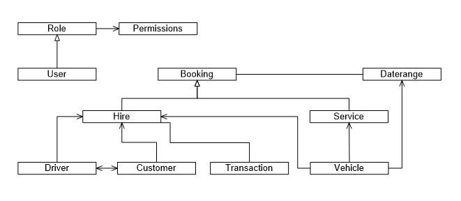
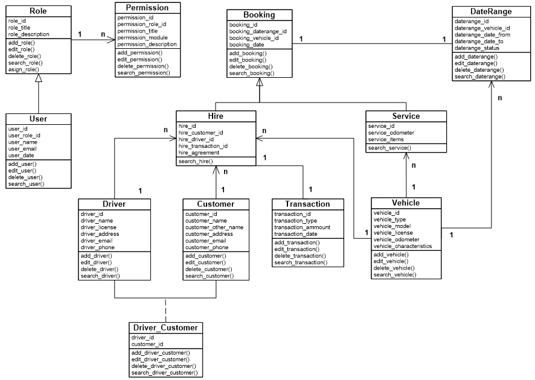

# rentacar

[GitHub Link](https://github.com/pdforest/rentacar)

This project is about a rent-a-car application that will be created using the object-oriented programming `(OOP)` paradigm due to the modeling of a real-life situation in which customers want to rent a car for a period of time and according to their needs.

Renting a car implies modeling objects, adding properties, methods and the possibility of being reusable, in addition to several types of objects the same functionality could be implemented, i.e. polymorphism.

Users need to be able to choose between locations, dates, times, and different types of features to rent a matching car, make reservations, and pay in advance.

A vehicle maintenance history will be kept and the mileage will be recorded so that the vehicles are tracked to always be in optimal condition.

`Here are the user-stories:`

## Index

1. After a new load (or update) of the application, the user should see a form for a quick search based on the pickup and delivery of the location, the date from and to, the time from and also offer the possibility to enter a discount code to apply.

2. An option to view reservations should always be available by entering an email and a reservation code number.

3. The option to log in or register must also be available for member features, but membership is not conditional on renting a car. Please use personal email for user identification.

## Dashboard

1. After hitting the search button, the app should display the top car rental deals based on the search criteria, add a panel for additional filter options, and also the search panel for changing the search conditions.

2. A button should be available to subbmit the order for the chosen option.

## Booking

1. It is a form to finalize the last conditions and to add the necessary information before the payment section.

## Payment

1. For the payment, the user can choose between different types such as card, cash, paypal, etc. for each type the payment must be processed online or in batches and the payment status must be updated.

2. Once payment is accepted, the vehicle can change status from reserved to ready.

## Service

1. It is a module for monitoring all tasks related to vehicle maintenance and damage. All CRUD operations.

## Vehicles

1. There should be a module to add vehicles with all the features. All CRUD operations.

## Customers

1. Customers can have more than one driver on their staff, for a single customer must be added as driver.

## Drivers

1. It is a module for the registration of drivers, all CRUD operations and the possibility of being part of the customer's driver staff.

`Objects map:`

`Class diagram:`

